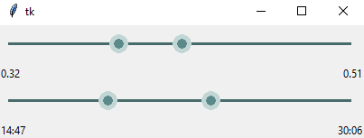

# RangeSlider

RangeSlider is a tkinter widget that features a two-headed range slider, useful for any situation that requires a user to mark approximate 'in' and 'out' points.
A demo (executed when running range_slider.py as main) is provided at the end of that file.

RangeSlider builds upon MenxLi's 'tkSliderWidget' at https://github.com/MenxLi/tkSliderWidget

# TODO

1. Allow custom styling of the bar / sliders.
2. Allow scaling of the contents upon resizing.